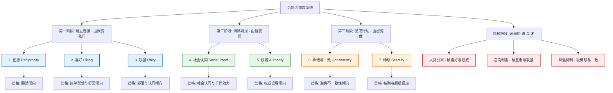

在社会动物的漫长演化史中，我们的大脑从未真正做好准备来应对信息爆炸的现代社会。为了在这个复杂的世界中生存，大脑进化出了一套**“启发式决策路径”**（Heuristics）——即罗伯特·西奥迪尼所说的“按下按钮，就发出嗡嗡声”（Click, whirr）的自动反应机制。

这套机制是人类在远古荒野生存的“外挂”：它通过把复杂的局势压缩为单一的信号，帮助我们在零点几秒内做出逃跑、分享、服从的决策。然而，在今天高度精密的社会博弈与商业系统里，这些原本用来拯救生命的算法，已经成为了操纵者眼中的“提现密码”。

如何从“局中人”的被动反应，蜕变为看清全局的“执棋者”？我们需要将西奥迪尼的影响力七大支柱，置于查理·芒格的“人类误判心理学”透镜下重新审视，构建一套属于我们自己的**认知防守与正向赋能系统**。

---

## 影响力与博弈系统的宏观图景

为了方便理解，我们将影响力的运作分为三个递进的阶段：**建立连接**、**消除疑虑**、**促成行动**。并在底部构建了基于第一性原理的“破局心法”。

---

## 🛠️ 第一阶段：建立连接（由“我”变“我们”）
**核心目标：打破本能的防卫机制，在两个孤立的主体间，快速织起一张情感的安全网。**

### 1. 互惠原则 (Reciprocity) —— 创造负债感
*   **心理学底层算法**：在人类祖先的协作网络中，食物的分享是跨越饥荒的唯一方法。不履行互惠义务的个体会被打上“赖账者”的烙印而被部落驱逐。因此，互惠成为刻进我们基因深处的强制性社会规范。
*   **查理·芒格的“补丁”**：**回馈倾向（Reciprocation Tendency）**。芒格指出，这种倾向不仅包含了以德报德的负债感，也包含了以怨报怨的报复本能。人类大脑对“被施予”的事物极度敏感，以至于即使接受了并不需要的礼物，依然会滋生出强烈的心理负担。
*   **术之暗用**：操纵者通过发放无门槛小额红包、赠送毫无实用价值却看似贴心的纪念品、或提供看似举手之劳的“特殊关照”，让你在潜意识中欠下人情债。当他们提出真正的无理要求时，你往往会在负债感的驱使下妥协。
*   **道之正引**：**纯粹的先验利他**。力求摒弃功利性的交换心态，主动作出真诚的、不求即时回报的付出。信任的本质就是先行的价值交付，在别人心里种下第一颗无私的种子。

### 2. 喜好原则 (Liking) —— 制造光环效应
*   **心理学底层算法**：大脑倾向于寻找安全感。如果对方具有吸引力（外表、性格或背景相似性），我们的大脑会启动“爱屋及乌”的自动补偿协议。这就是著名的**光环效应**（Halo Effect）：用单一的好感度，去推论对方在专业性、诚实度上的表现。
*   **查理·芒格的“补丁**”：**好恶倾向（Liking/Loving Tendency & Disliking/Hating Tendency）**。一旦喜欢上某人，大脑就会选择性忽略对方的缺点，甚至会主动为其愚蠢的言行编造借口；反之，若讨厌某人，则会全盘否定其正确的观点。
*   **术之暗用**：操纵者精心打磨社交媒体人设，包装高级审美品味，并用“同乡、同校、同星座、同苦难经历”的镜像策略（Mirroring）无限拉近距离，甚至通过精确的恭维（即使这种恭维并不属实）来诱降你的理性防御。
*   **道之正引**：**发现真正的闪光点**。并不是要去虚伪地迎合，而是带着善意和敬畏去发掘对方身上客观存在的闪光点。人往往会为了不辜负那个真正看重、赏识自己的人，而自我进化得更好。

### 3. 联盟原则 (Unity) —— 模糊身份界限
*   **心理学底层算法**：西奥迪尼在《影响力》新版中增加的第七大原则。“我们”不仅是一个词，更是一种基因层面的归属感。一旦被归入同一个群体（共同的姓氏、血统、地域、乃至小众爱好），个体之间的防御围墙就会瞬间崩塌。
*   **查理·芒格的“补丁”**：**部落归属与党派倾向**。人们在集体中倾向于丧失独立的批判思维，转而追随领袖和集体共识，因为被集体排挤的恐惧深入骨髓。
*   **术之暗用**：以“家人们”、“战友”、“内部圈子”等词汇进行虚无的情感捆绑，或者制造一个共同的虚拟敌人（如“割韭菜的传统机构”、“看不懂时代潮流的旧势力”），通过“我们与他们”的对立，让你放弃客观的财务或道德审查。
*   **道之正引**：**构建真正的共同目标与命运共同体**。将客户、团队和合作伙伴从“甲方乙方”的零和博弈中拉出来，变成站在同一战壕里去攻克客观难题的战友。

---

## 🔍 第二阶段：消除疑虑（由“疑”变“信”）
**核心目标：面对未知的恐惧和决策成本，通过外部锚点，为逻辑提供支撑，让理性可以借力。**

### 4. 社会认同 (Social Proof) —— 进化的羊群效应
*   **心理学底层算法**：在蛮荒时代，如果看到同伴突然惊恐地朝某个方向奔跑，最安全的做法是立刻跟着跑，而不是停下来思考到底有没有野兽。不合群的人在几十万年前就已经绝嗣了。社会认同是我们写在血液里的**进化避险逻辑**。
*   **查理·芒格的“补丁”**：**社会认同倾向（Social-Proof Tendency）**。当形势不明朗、或者人处于极度焦虑和压力之下时，社会认同倾向会达到峰值。此时，人不仅会效仿别人，而且很容易被蓄意制造出来的“多数人行为”裹挟。
*   **术之暗用**：在虚假的投资群或交易群中，数十名“托”源源不断地晒出豪车钥匙、提现成功的截图、虚假的收益账单。他们正是利用了你“如果我不加入，我就会被时代抛弃”的巨大剥夺焦虑，对你发起认同围猎。
*   **道之正引**：**真实案例与去伪存真**。不编造数据，不粉饰太平，以最真实的客户成长故事、痛点解决过程和同行评价，给未知的合作方建立起逻辑与事实上的双重信任。

### 5. 权威原则 (Authority) —— 盲目服从符号
*   **心理学底层算法**：社会协作的运转依赖于对合理权威的顺从，否则社会秩序就会退化成丛林法则。但是，大脑为了节省运算能量，往往会模糊“权威的实际能力”与“权威的象征符号”之间的区别。
*   **查理·芒格的“补丁”**：**权威误导倾向（Authority-Mismeeting Tendency）**。芒格极为犀利地指出，人类由于天生对权威的服从，不仅会服从专家的合理指令，也会服从其荒谬至极的命令（如米尔格拉姆电击实验）。更糟糕的是，人们往往被头衔、豪车、西装等“权威符号”所误导，而非权威本身的智识。
*   **术之暗用**：租用高级写字楼、伪造与名流的合影、给自己挂上各种“全球研究员”、“首席架构师”的头衔。用充满缩写和黑话的行业 PPT、复杂的精算图表，直接击溃受害者的常识直觉，使之不敢提问、选择盲从。
*   **道之正引**：**用真正的专业深度和事实证据背书**。摒弃虚夸的头衔，用鞭辟入里的行业本质剖析、逻辑自洽的方案路径、以及敢于承认局限性的诚实态度，来赢得长久的专业信任。

---

## 🚀 第三阶段：促成行动（由“想”变“做”）
**核心目标：打破临门一脚的拖延，切断退路，将认知转化为不可逆的行为。**

### 6. 承诺与一致 (Consistency) —— 琥珀锁死效应
*   **心理学底层算法**：一旦我们在公开场合表达了某种立场，或者付出了某种行动（哪怕微不足道），我们就会面临巨大的社会压力和心理拉力，去维护这个立场，以此显得自己“言行一致、靠谱且不自相矛盾”。
*   **查理·芒格的“补丁”**：**避免不一致性倾向（Inconsistency-Avoidance Tendency）**。芒格打了一个生动的比方：人会像封在琥珀里的虫子一样，被自己过去的决定牢牢锁死。因为否定自己过去的努力，等同于承认自己过去的愚蠢。这种心理抗拒导致人们在错误的道路上继续追加筹码，陷入“沉没成本”（Sunk Cost）的黑洞。
*   **术之暗用**：操纵者首先诱导你投入微不足道的本金，或者填写一份无害的意向调查（小承诺）。一旦你完成了这个动作，他们就会利用你“不想承认之前做错”和“维持自我形象”的心理，诱导你不断追加资金去拯救之前的投入，直到万劫不复。
*   **道之正引**：**正向微小契约**。对于习惯拖延、无法迈出第一步的人，通过引导他们做出极其微小且正向的主动表态（例如：“今天我只看 5 分钟书，并做卡片”）。利用一致性原理，让积极的行动自我滚雪球。

### 7. 稀缺原则 (Scarcity) —— 被剥夺超级反应
*   **心理学底层算法**：对失去的恐惧，远远大于对得到的渴望。当一件物品变得难以获取时，我们失去它的可能性增加，这会激起本能的“心理逆反”（Psychological Reactance）：我们不仅会觉得它更珍贵，还会由于自由被限制而产生焦虑和占有欲。
*   **查理·芒格的“补丁”**：**被剥夺超级反应倾向（Deprival-Superreaction Tendency）**。当一个人即将失去某种他认为属于自己（或者几乎属于自己）的东西时，他的理智会瞬间宕机，产生野兽般的争夺本能。芒格指出，这是让人走向财务毁灭的最快途径之一。
*   **术之暗用**：将稀缺性与“社交隔离”和“时间限锁”进行终极绞杀。例如在四人小群里，另外三个人（托）都付了钱，骗子告诉你“这是最后一个名额，就差你一个人付款，系统才能解锁，大家才能一起提现”。这种将“最后一人”的窒息感、道德勒索和剥夺超级反应融为一体的圈套，可以在一瞬间关闭当事人的理智闸门。
*   **道之正引**：**真诚提示客观红利**。不制造人为恐慌，而是站在客观理性的角度，向合作者清晰梳理出行业周期的真实时间窗口与发展机遇，帮助其权衡利弊，在红利消失前果断决策。

---

## 🧭 行动者的终极心法：破局的“道与术”

当我们彻底看清了这套机制的运作逻辑，我们也就掌握了最高明的防守武器。在现代社会的博弈中，有三条不可动摇的黄金法则，能帮我们从沦为他人提现机的被动局中脱身，重回执棋者的主动位。

### 🛡️ 破局之术：三大降维防线

| 破局法则 | 针对的心理算法 | 具体操作路径（怎么做） |
| :--- | :--- | :--- |
| **1. 人货分离** | 破喜好原则 / 破权威原则 | 在做重大决定（财务、签约、选择）时，强迫自己把“请求者的人格魅力”和“请求本身的客观逻辑”切开。试着在脑海中把眼前光鲜亮丽的导师，替换成一个你最讨厌的人。如果由他用同样的逻辑向你推销，你还会买单吗？ |
| **2. 逆向利害** | 破互惠原则 / 破联盟原则 | 永远多问自己一句：“根据客观的激励机制，对方这么热心地带着我赚钱、帮我规划人生，对他到底有什么好处？” 记住：**当你在桌上看不清对方赢利点时，你就是那个利润来源。** |
| **3. 降温机制** | 破稀缺原则 / 破一致原则 | 稀缺的饼干并不会更好吃。凡是遇到任何催促你“快点”、“名额仅限今天”、“就差你一个”的场景，立刻判定进入“认知高危区”。唯一的动作是：**切断网络、关掉手机、上床睡觉。** 绝对不在心跳加速、肾上腺素飙升的情况下做任何决定。 |

### 🔑 破局之道：影响力的底线
> “影响力不是一根用来强行拽人的绳子，而是一盏灯，照亮对方本来就该走的正确道路。”

如果将影响力作为操纵人心的工具，最终必然会被“避免不一致倾向”和“回馈倾向（以牙还牙）”反噬，落得信誉破产的下场。

对于真正的觉醒者而言，践行影响力的终极法门只有八个字：
**真实第一（Authenticity）**，**双赢共生（Win-Win）**。
唯有如此，道与术才能归于统一，你所发出的光芒，才不会成为灼伤他人的火焰，而是照亮彼此前路的路灯。
